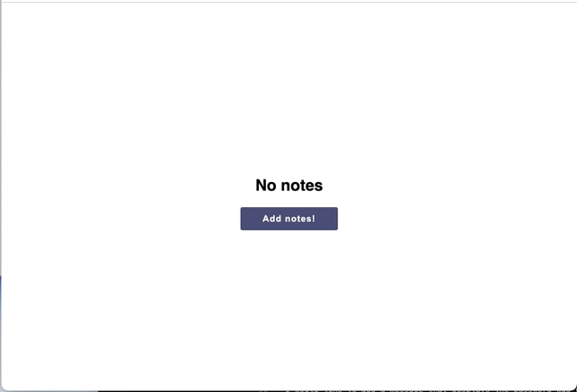

# React notepad

This is a project based on Scrimba's frontend developer career path

## Overview

The goal of this project was to practice `.useState()`, `.useEffect()`, `props`.

### Screenshot

### Link 

[Live site](https://react-notepad-one.vercel.app/)

### Built with 

- CSS
- React
- NPM (split, react-mde, showdown)
