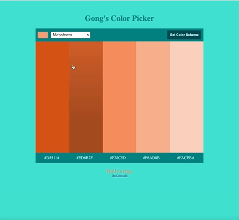

# Color Picker

Project is part of Scrimba's Frontend Developer Career Path

## Overview

This is a solo project I've completed throughout Scrimba's frontend web developer path.

The purpose of this project was to familiarize myself with using the fetch API and HTML form inputs.
The user can select their color and color scheme, and the program will then return different color patterns and the hex codes for each color. I built this with an additional function of copying the hex color on click.

## Screenshot

## Links

- [Live site](https://quanglyho.github.io/solo_projects/color-picker/)

## Built with

- HTML5
- CSS
- Javascript
- [The Color API](https://www.thecolorapi.com/)

