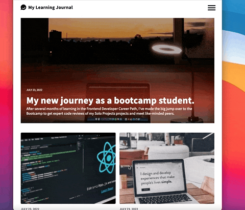
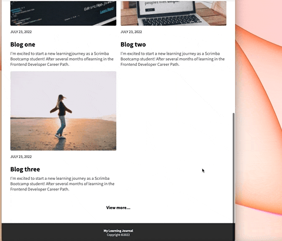

# Learning Journal

Project is part of Scrimba's Frontend Developer Career Path

## Overview

This is a solo project I've completed throughout Scrimba's frontend web developer path.

Goal was to develop a fully responsive blogspace with a mobile first design process. Project includes building multiple pages using flexbox, grid, and media queries. A stretch goal that was achieved on this project was implimenting a fold-out hamburger menu for the navigation bar.

## Screenshot

## Links

- [Live site](https://quanglyho.github.io/solo_projects/learning-journal/)

## Built with

- HTML5
- CSS
- Vanilla Javascript
