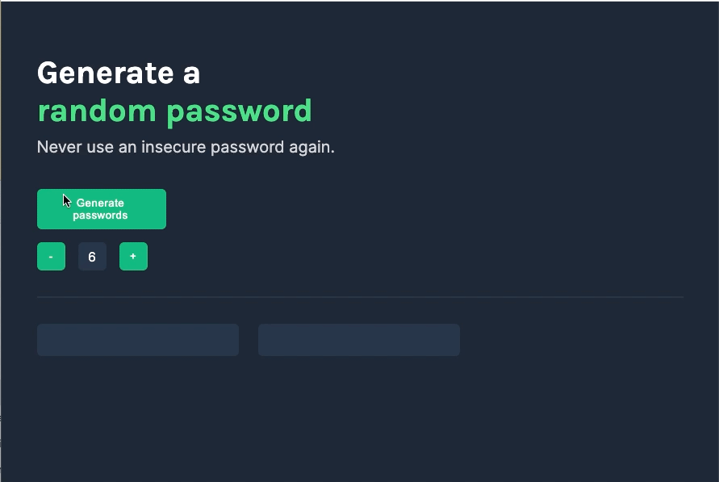

# Password Generator

Project is part of Scrimba's Frontend Developer Career Path

## Overview

This is a solo project I've completed throughout Scrimba's frontend web developer path.

Generates two different randomized passwords with a increment/decrement button to adjust the length of the desired password. Also has a click to copy function on the password outputs.

## Screenshot

## Links

- [Live site](https://quanglyho.github.io/solo_projects/password-generator/)

## Built with

- HTML5
- CSS
- Vanilla Javascript

## Continued development 

I would like to add a message that displays the password was copied when clicked.

