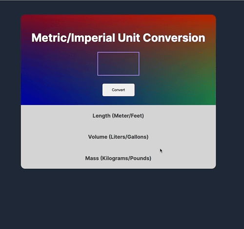

# Unit converter

Project is part of Scrimba's Frontend Developer Career Path

## Overview

This is a solo project I've completed throughout Scrimba's frontend web developer path.

Converts input number from metric to imperial and vice versa. Input is limited to four digits and no negatives accepted.

## Screenshot

## Links

- [Live site](https://quanglyho.github.io/solo_projects/unit-converter/)

## Built with

- HTML5
- CSS
- Vanilla Javascript

